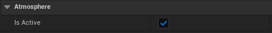
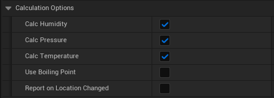
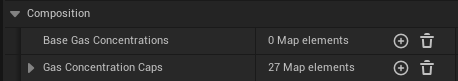
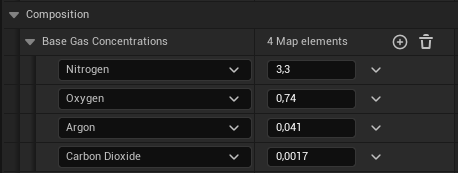
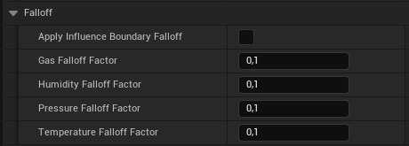
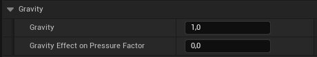
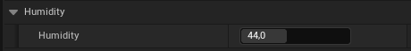
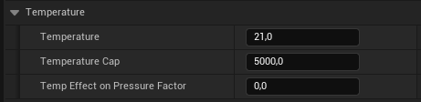
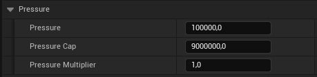

# Atmosphere Actor

This section provides an overview of the attributes of the **Atmosphere Actor** presenting multiple configurations that can influence the calculations of fundamental composition and the impact on **Influence Actors** and their affect on the atmosphere.

## Atmosphere

| Property| Type| Description|
| ------------------------------------ | ------------------------------------ | --------------------------------------------------------------------------------------------- |
| Is Active| Boolean| Toggle to activate the atmosphere simulation. |

### Calculation Options

| Property | Type | Description |
| ------------------------------------ | ------------------------------------ | --------------------------------------------------------------------------------------------- |
| Calc Humidity| Boolean| Toggle to calculate humidity.|
| Calc Pressure| Boolean| Toggle to calculate atmospheric pressure.|
| Calc Temperature| Boolean| Toggle to calculate temperature.|
| Use Boiling Point| Boolean| Checks if the temperature at the center of the **Gas Vent** or **Absorber** is above the boiling point and only then emits or absorbs gas. |
| Report On Location Changed| Boolean| Report changes only when location vector passed changes.|

### Composition

| Property | Type | Description |
| ------------------------------------ | ------------------------------------ | --------------------------------------------------------------------------------------------- |
| Base Gas Concentrations| Map<[Gas Type](https://carboniq-dev.github.io/site/aero-sim/gases), float>| Base gas amount applied t the atmosphere. |
| Gas Concentration Caps| Map<[Gas Type](https://carboniq-dev.github.io/site/aero-sim/gases), float>| Gas amount caps.|

#### Example Composition

### Influence

| Property | Type | Description |
| ------------------------------------ | ------------------------------------ | --------------------------------------------------------------------------------------------- |
| Influence Unbound | Boolean | If true, the influence is always active, regardless of distance.|
| Use Cubic Influence | Boolean | If true, calculations regarding influence will be based on a cubic shape.|
| Influence Extent | Float | This parameter defines the spatial extent of the atmospheric region, specifying the maximum distance from the central point of the atmospheric. |

### Falloff

| Property | Type | Description |
| ------------------------------------ | ------------------------------------ | --------------------------------------------------------------------------------------------- |
| Apply Atmospheric Boundary Falloff | Boolean | Activates simulation of decreasing impact with increasing distance from the atmosphere's center.|
| Gas Falloff Factor | Float | Determines the rate at which gas amount decreases as measurements approach the outer boundary of the atmosphere. Higher values result in a sharper decrease.|
| Humidity Falloff Factor | Float | Determines the rate at which humidity decreases as measurements approach the outer boundary of the atmosphere. Higher values result in a sharper decrease.|
| Pressure Falloff Factor | Float | Determines the rate at which the base pressure decreases as measurements approach the outer boundary of the atmosphere. Higher values result in a more pronounced decrease.|
| Temperature Falloff Factor | Float | Determines the rate at which temperature decreases as measurements approach the outer boundary of the atmosphere. Higher values result in a more pronounced decrease.|

### Gravity

!!! Info 
    Used only for pressure calculations.

| Property | Type | Description |
| ------------------------------------ | ------------------------------------ | --------------------------------------------------------------------------------------------- |
| Gravity| Float| Planets average gravity.|
| Gravity Effect On Gas Factor | Float| Determines how much gravity affects the gas concentration.|

### Humidity

| Property | Type | Description |
| ------------------------------------ | ------------------------------------ | --------------------------------------------------------------------------------------------- |
| Humidity| Float| Planets average humidity. |
| Humidity Effect On Gas Factor| Float| Determines how much humidity affects the gas concentration.|

### Temperature

| Property | Type | Description |
| ------------------------------------ | ------------------------------------ | --------------------------------------------------------------------------------------------- |
| Temperature| Float| Planets average temperature.|
| Temperature Cap| Float| The maximum cap for temperature in the atmosphere calculation.|
| Temp Effect On Gas Factor| Float| Determines how much temperature affects the gas concentration.|

### Pressure

| Property | Type | Description |
| ------------------------------------ | ------------------------------------ | --------------------------------------------------------------------------------------------- |
| Pressure | Float| Base pressure applied to the atmosphere. |
| Pressure Cap| Float| The maximum cap for atmospheric pressure in the atmosphere calculation. |
| Pressure Multiplier| Float| A modifier that adjusts the rate of atmospheric pressure buildup, used to either increase or decrease the resulting pressure. |

### Visuals

| Property | Type | Description |
| ------------------------------------ | ------------------------------------ | --------------------------------------------------------------------------------------------- |
| Show Bounds| Boolean| Determines whether to show the boundary area visually. |
| Bounds Color| Linear Color | Color of the bounds indicator. |

### Debug

| Property | Type | Description |
| ------------------------------------ | ------------------------------------ | --------------------------------------------------------------------------------------------- |
| Show Debug Panel| Boolean| Displays a debug panel showing the atmosphere measurement values. |
