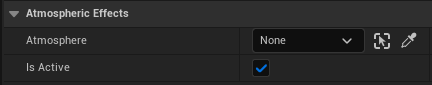
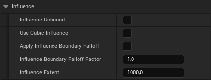
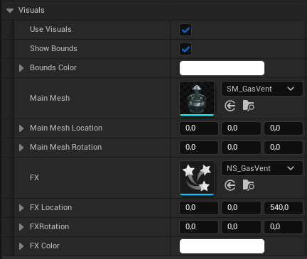
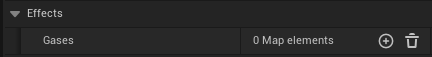
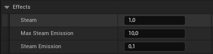
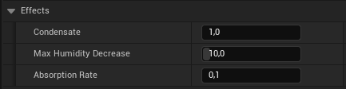
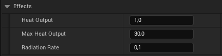
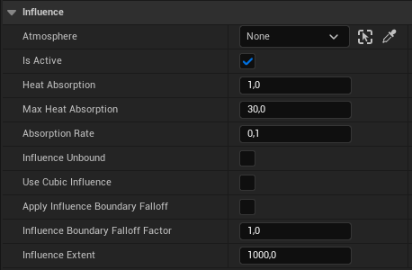

# Influence Actors

This section offers a summary of the properties of the **Influence Actors** that impact the calculations related to atmospheric composition.

## Common properties

All {==Influence==} Actors come with a set of common properties to control their behavior and appearance.

### Main

| Property| Type| Description|
|----------------------|--------------------------------------|----------------------------------------------------------------------|
| Atmosphere| Actor | The atmosphere the influence actor should be assigned to. |
| Is Active| Boolean | Activates or deactivates the atmospheric influence. |

### Influence

| Property| Type| Description|
|----------------------|--------------------------------------|----------------------------------------------------------------------|
| Influence Unbound| Boolean | If true, the influence is always active, regardless of distance. |
| Use Cubic Influence	| Boolean | If true, calculations regarding influence will be based on a cubic shape. |
| Apply Influence Boundary Falloff	| Boolean | Activates simulation of decreasing impact with increasing distance from the actors's center. |
| Influence Boundary Falloff Factor	| Float | Determines the rate at which the influence effects decrease towards the outer boundary. Higher values result in a sharper decrease. |
| Influence Extent	| Float | Range within which the influence is effective. |

### Visuals

| Property| Type| Description|
|----------------------|--------------------------------------|----------------------------------------------------------------------|
| Use Visuals	| Boolean | Toggle to use the built-in visual representations. |
| Show Bounds	| Boolean | Determines whether to show the bounds visually. |
| Bounds Color	| Linear Color | Color of the bounds indicator. |
| Main Mesh	| Static Mesh | The main mesh to represent the atmospheric source visually. |
| Main Mesh Location	| Vector | Location of the main mesh. |
| Main Mesh Rotation	| Rotator | Rotation of the main mesh. |
| FX| Niagara System | The Niagara system to represent the atmospheric effect visually. |
| FX Location	| Vector | Location of the Niagara effects. |
| FX Rotation	| Rotator | Rotation of the Niagara effects. |
| FX Color	| Linear Color | Color of the Niagara effects. |

## Gas Vent

| Property| Type| Description|
|----------------------|--------------------------------------|----------------------------------------------------------------------|
| Gases| Map<[Gas Type](https://carboniq-dev.github.io/site/aero-sim/gases), [Gas Config](https://carboniq-dev.github.io/site/aero-sim/measurement/#gase-config)>| Defines the types and properties of gases emitted to the atmosphere.|

## Absorber

| Property| Type| Description|
|----------------------|--------------------------------------|----------------------------------------------------------------------|
| Gases| Map<[Gas Type](https://carboniq-dev.github.io/site/aero-sim/gases), [Gas Config](https://carboniq-dev.github.io/site/aero-sim/measurement/#gase-config)>| Defines the types and properties of gases absorbed from the atmosphere.|

## Steam Vent

| Property| Type| Description|
|----------------------|--------------------------------------|----------------------------------------------------------------------|
| Steam| Float| Average steam produced.|
| Max Steam Emission| Float| Maximum limit of steam emission.|
| Steam Emission| Float| Rate at which steam is emitted.|

## Condenser

| Property| Type| Description|
|----------------------|--------------------------------------|----------------------------------------------------------------------|
| Condensate| Float| Average humidity.|
| Max Humidity Decrease| Float| Maximum amount of humidity decrease allowed.|
| Absorption Rate| Float| Rate at which humidity is absorbed.|

## Heater

| Property| Type| Description|
|----------------------|--------------------------------------|----------------------------------------------------------------------|
| Heat Output| Float| Average heat output of the heater.|
| Max Heat Output| Float| Maximum heat output.|
| Radiation Rate| Float| Rate at which heat is radiated.|

## Cooler

| Property| Type| Description|
|----------------------|--------------------------------------|----------------------------------------------------------------------|
| Heat Absorption| Float| Avergae heat absorbed by cooler.|
| Max Heat Absorption| Float| Maximum heat absorbed.|
| Absorption Rate| Float| Rate at which heat is absorbed. |
