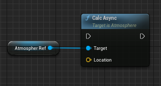
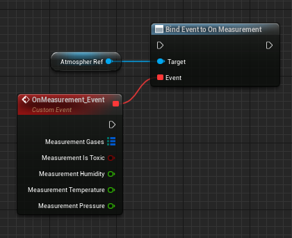

# Nodes

## **Calc Async** Function

This function must be run to initiate the calculation process. For instance, input the location by using the position of your player or camera actor.

## **On Measurement** Delegate

To obtain measurement values, you must establish a connection to the *OnMeasurement* delegate by binding a custom event. Alternatively, if you are in the early stages of development and simply require to access the values, you can utilize the integrated debug panel.

