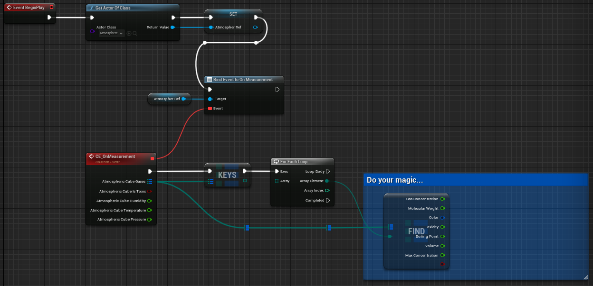
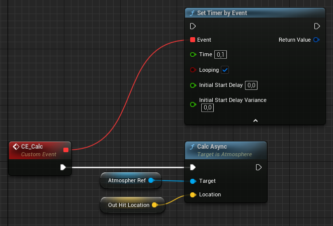

# Usage

## Setup

The way to get started is by simply dragging the **Atmosphere** actor into the world, along with any **influence actor** you want to impact the atmosphere. For instance, you can add a **Vent** actor and specify the gases you want it to emit. Explore the gas properties and actor settings to configure your custom influence.

Open up the actor that should contain the logic and add the following setup:

### On Begin Play

### Execute calculation

Depending on your specific requirements, you should connect the following nodes to an event such as _Begin Play_ using a timer, or execute the **CalcAsync** during a _Click_ event. It is advisable to avoid using the calculation function in the _Tick_ event. Although the calculation is asynchronous, its use, particularly in scenarios like widget updates, could still affect performance without significantly improving your gameplay.

## Custom Blueprints

You also have the option to create blueprints from the influence actors, allowing them to incorporate custom features, meshes, and any other elements you desire. This enables you to enhance and personalize the influence actors to meet your specific needs and preferences.

## Visual Components

The plugin includes pre-designed visual components that offer the choice of either a rapid setup or customization through the exposed parameters. Additionally, you can access the bundled Niagara System and Materials for further editing, or as mentioned earlier, deactivate them entirely and create a unique blueprint derived from the particular influence actor.

## Examples

If you want to see an example implementation, please checkout the [Github Repo](https://github.com/carboniq-dev/aero-sim-examples)

