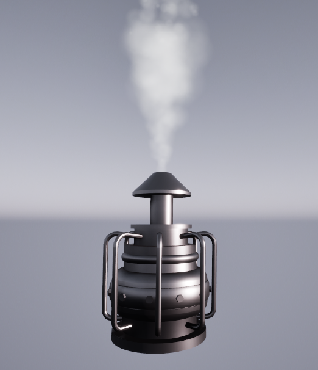

# Visuals

The images below display the ready-to-use built-in components, allowing you to focus on the simulation during development without the hassle of dealing with meshes and effects.

## Gas

### Absorber

{ width="400" }

### Vent

{ width="400" }

## Temperature

### Heater

{ width="400" }

### Cooler

{ width="400" }

## Humidity

### Steam Vent

{ width="400" }

### Condenser

{ width="400" }
