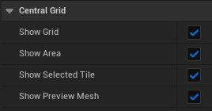
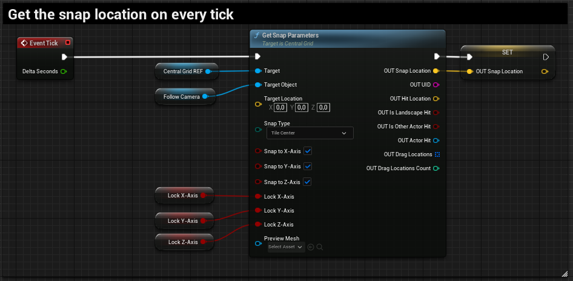
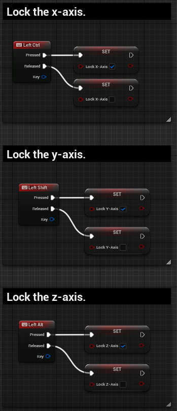
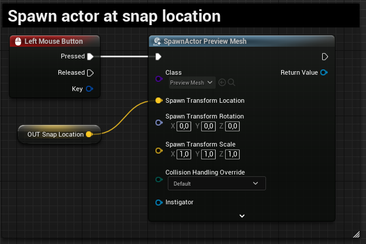

# Example

The following steps demonstrate one possible setup for using the snap functionality in a game.

## Add the Grid Actor

1. Create a project by selecting the third person template.
1. Open the project.
1. Go to the Place Actor tab and search for the **Central Grid** actor.
1. Drag the actor into your world and set the grid visuals to true.

## Add the function

1. Open the character blueprint or any other blueprint you wish to place the logic into.
1. Create a reference to the **Central Grid** actor.
1. Drag out from the actor reference and search for the **Get Snap Parameter** function.
1. Create a reference to the _Camera Component_ and connect it to the **Target Object** pin.
1. Set the **Snap Type** to _Highest Corner_.
1. Tick all **Snap to** checkboxes.
1. Split the **Lock** pin and create the three boolean variables named _Lock X-Axis_, _Lock Y-Axis_ and _Lock Z-Axis_ and connect them to the corresponding **Lock** pin. Alternatively you can right click the pins and promote them to a variable.
1. Split the **OUT** pin and promote the **Snap Location** to a variable.

## Hook up events

1. In this example we use the _Left Ctrl_, _Left Shift_ and _Left Alt_ key to toggle the boolean variables.
1. To use the snap location, simply facilitate the built-in Unreal Engine _Spawn Actor_ function to spawn any actor at the snap location. In this example we use the _Left Mouse Button_ to execute.

