# Generators

The subsequent functions produce a diverse range of 2D and 3D shapes. Each generator yields a set of vectors that collectively define the respective shape.

## 2D

### Line

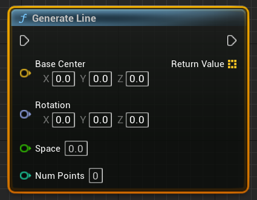{ width="300" }

| Property    | Type     | Description              |
| ----------- | -------- | ------------------------ |
| BaseCenter  | FVector  | Center of the line.      |
| Rotation    | FRotator | Rotation of the line.    |
| Space       | float    | Spacing between points.  |
| NumPoints   | int      | Number of points.        |

### Circle

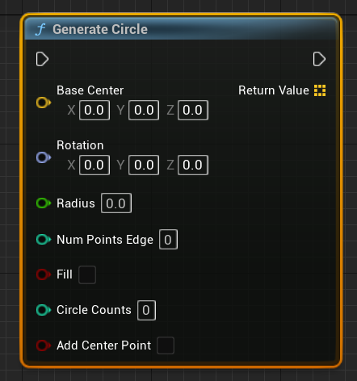{ width="300" }

| Property          | Type    | Description                           |
| ----------------- | ------- | ------------------------------------- |
| BaseCenter        | FVector | Center of the circle.                 |
| Rotation          | FRotator| Rotation of the circle.               |
| Radius            | float   | Radius of the circle.                 |
| NumPointsEdge     | int     | Number of points on the edge.         |
| Fill              | bool    | Whether to fill the circle.           |
| CircleCounts      | int     | Number of circles to generate.        |
| bAddCenterPoint   | bool    | Whether to add a center point.        |

### Heart

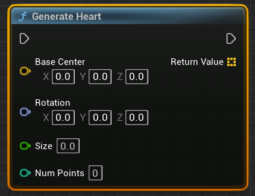{ width="300" }

| Property    | Type     | Description              |
| ----------- | -------- | ------------------------ |
| BaseCenter  | FVector  | Center of the heart.     |
| Rotation    | FRotator | Rotation of the heart.   |
| Size        | float    | Size of the heart.       |

### Pentagon

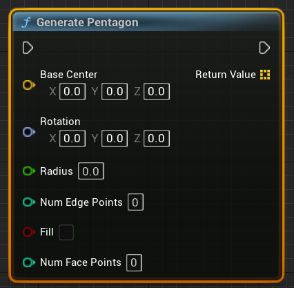{ width="300" }

| Property          | Type    | Description                           |
| ----------------- | ------- | ------------------------------------- |
| BaseCenter        | FVector | Center of the pentagon.               |
| Rotation          | FRotator| Rotation of the pentagon.             |
| Radius            | float   | Radius of the pentagon.               |
| NumEdgePoints     | int     | Number of points on the edge.         |
| Fill             | bool    | Whether to fill the pentagon.         |
| NumFacePoints     | int     | Number of points on the face.         |

### Rectangle

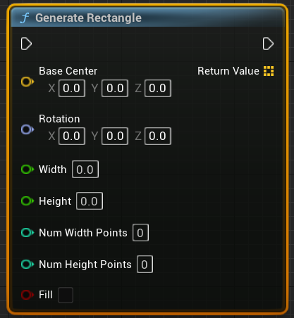{ width="300" }

| Property          | Type    | Description                           |
| ----------------- | ------- | ------------------------------------- |
| BaseCenter        | FVector | Center of the rectangle.              |
| Rotation          | FRotator| Rotation of the rectangle.            |
| Width             | float   | Width of the rectangle.               |
| Height            | float   | Height of the rectangle.              |
| NumWidthPoints    | int     | Number of points along the width.     |
| NumHeightPoints   | int     | Number of points along the height.    |
| Fill              | bool    | Whether to fill the rectangle.        |

### Sine Wave

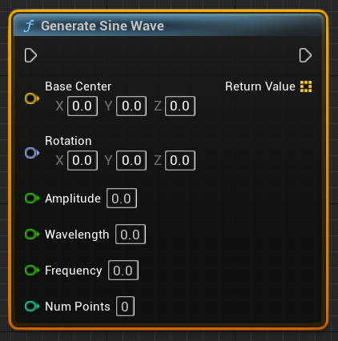{ width="300" }

| Property    | Type     | Description              |
| ----------- | -------- | ------------------------ |
| BaseCenter  | FVector  | Center of the sine wave. |
| Rotation    | FRotator | Rotation of the sine wave.|
| Amplitude   | float    | Amplitude of the wave.   |
| Wavelength  | float    | Wavelength of the wave.  |
| Frequency   | float    | Frequency of the wave.   |
| NumPoints   | int      | Number of points.        |

### Growing Sine Wave

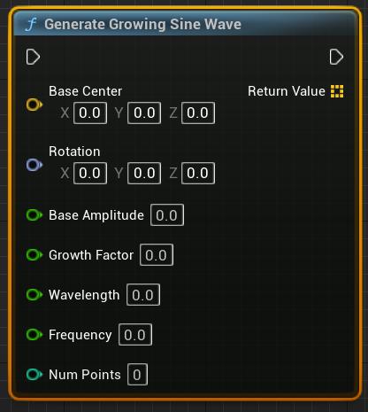{ width="300" }

| Property       | Type     | Description                     |
| -------------- | -------- | ------------------------------- |
| BaseCenter     | FVector  | Center of the growing wave.     |
| Rotation       | FRotator | Rotation of the growing wave.   |
| BaseAmplitude  | float    | Initial amplitude of the wave.  |
| GrowthFactor   | float    | Growth factor of the amplitude. |
| Wavelength     | float    | Wavelength of the wave.         |
| Frequency      | float    | Frequency of the wave.          |
| NumPoints      | int      | Number of points.               |

### Triangle

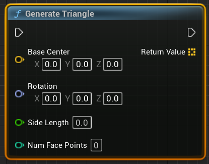{ width="300" }

| Property       | Type     | Description                |
| -------------- | -------- | -------------------------- |
| BaseCenter     | FVector  | Center of the triangle.    |
| Rotation       | FRotator | Rotation of the triangle.  |
| SideLength     | float    | Length of each side.       |
| NumFacePoints  | int      | Number of points.          |

### Yin Yang

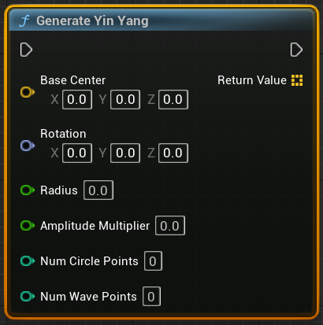{ width="300" }

| Property           | Type     | Description                     |
| ------------------ | -------- | ------------------------------- |
| BaseCenter         | FVector  | Center of the Yin-Yang symbol. |
| Rotation           | FRotator | Rotation of the Yin-Yang symbol.|
| Radius             | float    | Radius of the symbol.           |
| AmplitudeMultiplier| float    | Multiplier for amplitude.       |
| NumCirclePoints    | int      | Number of points for circles.   |
| NumWavePoints      | int      | Number of points for waves.     |

## 3D

### Cone

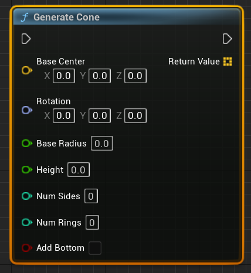{ width="300" }

| Property      | Type     | Description               |
| ------------- | -------- | ------------------------- |
| BaseCenter    | FVector  | Center of the cone.       |
| Rotation      | FRotator | Rotation of the cone.     |
| BaseRadius    | float    | Radius of the base.       |
| Height        | float    | Height of the cone.       |
| NumSides      | int      | Number of sides.          |
| NumRings      | int      | Number of rings.          |
| bAddBottom    | bool     | Whether to add the bottom.|

### Cylinder

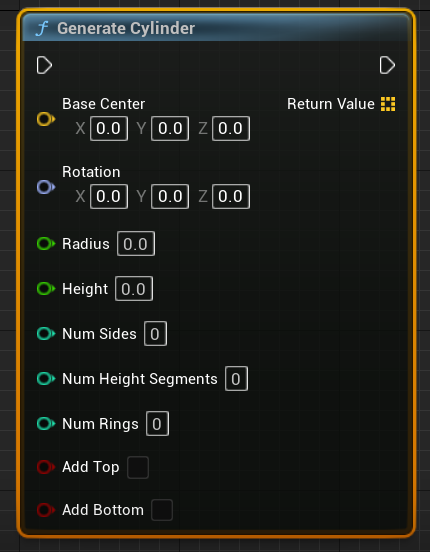{ width="300" }

| Property           | Type     | Description                      |
| ------------------ | -------- | --------------------------------|
| BaseCenter         | FVector  | Center of the cylinder.         |
| Rotation           | FRotator | Rotation of the cylinder.       |
| Radius             | float    | Radius of the cylinder.         |
| Height             | float    | Height of the cylinder.         |
| NumSides           | int      | Number of sides.                |
| NumHeightSegments  | int      | Number of height segments.      |
| NumRings           | int      | Number of rings.                |
| bAddTop            | bool     | Whether to add the top.         |
| bAddBottom         | bool     | Whether to add the bottom.      |

### Helix

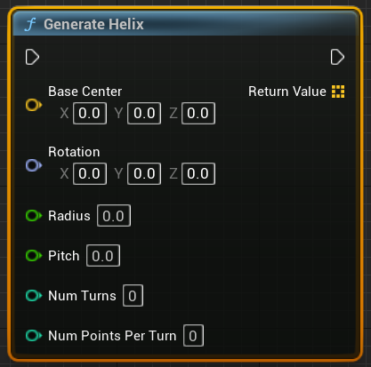{ width="300" }

| Property         | Type     | Description                |
| ---------------- | -------- | -------------------------- |
| BaseCenter       | FVector  | Center of the helix.       |
| Rotation         | FRotator | Rotation of the helix.     |
| Radius           | float    | Radius of the helix.       |
| Pitch            | float    | Pitch of the helix.        |
| NumTurns         | int      | Number of turns.           |
| NumPointsPerTurn | int      | Number of points per turn. |

### Pyramid

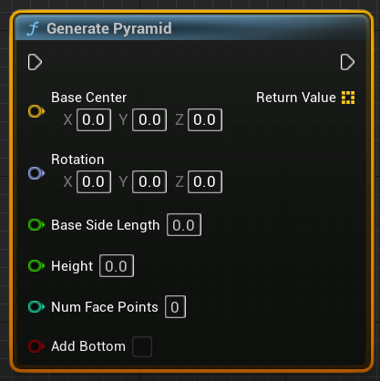{ width="300" }

| Property       | Type     | Description                |
| -------------- | -------- | -------------------------- |
| BaseCenter     | FVector  | Center of the pyramid.     |
| Rotation       | FRotator | Rotation of the pyramid.   |
| BaseSideLength | float    | Length of each base side.  |
| Height         | float    | Height of the pyramid.     |
| NumFacePoints  | int      | Number of face points.     |
| bAddBottom     | bool     | Whether to add the bottom. |

### Rectangle Prism

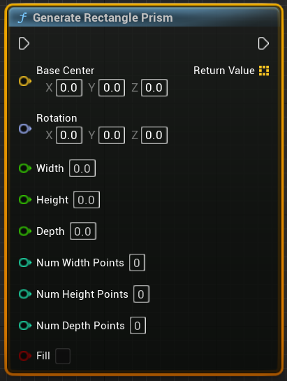{ width="300" }

| Property        | Type     | Description                           |
| --------------- | -------- | ------------------------------------- |
| BaseCenter      | FVector  | Center of the rectangular prism.      |
| Rotation        | FRotator | Rotation of the rectangular prism.    |
| Width           | float    | Width of the rectangular prism.       |
| Height          | float    | Height of the rectangular prism.      |
| Depth           | float    | Depth of the rectangular prism.       |
| NumWidthPoints  | int      | Number of points along the width.     |
| NumHeightPoints | int      | Number of points along the height.    |
| NumDepthPoints  | int      | Number of points along the depth.     |
| Fill           | bool     | Whether to fill the rectangular prism.|

### Sphere

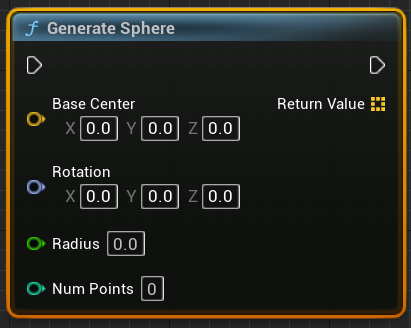{ width="300" }

| Property    | Type     | Description               |
| ----------- | -------- | -------------------------|
| BaseCenter  | FVector  | Center of the sphere.    |
| Rotation    | FRotator | Rotation of the sphere.  |
| Radius      | float    | Radius of the sphere.    |
| NumPoints   | int      | Number of points.        |

### Growing Spiral

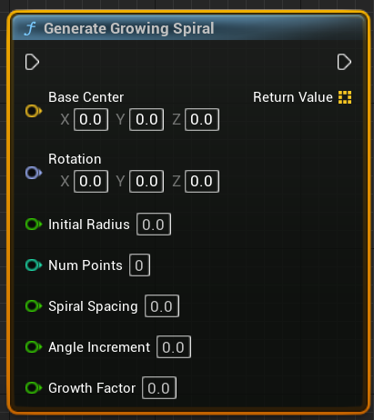{ width="300" }

| Property        | Type     | Description                     |
| --------------- | -------- | -------------------------------|
| BaseCenter      | FVector  | Center of the growing spiral.  |
| Rotation        | FRotator | Rotation of the growing spiral.|
| InitialRadius   | float    | Initial radius of the spiral.  |
| NumPoints       | int      | Number of points.              |
| SpiralSpacing   | float    | Spacing between spirals.       |
| AngleIncrement  | float    | Increment angle.               |
| GrowthFactor    | float    | Growth factor of the spiral.   |

### Torus

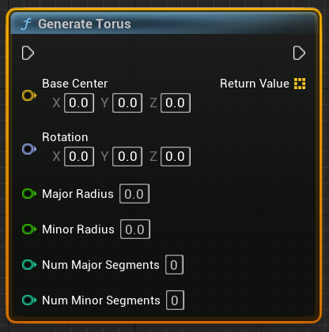{ width="300" }

| Property          | Type     | Description                       |
| ----------------- | -------- | --------------------------------- |
| BaseCenter        | FVector  | Center of the torus.              |
| Rotation          | FRotator | Rotation of the torus.            |
| MajorRadius       | float    | Major radius of the torus.        |
| MinorRadius       | float    | Minor radius of the torus.        |
| NumMajorSegments  | int      | Number of major segments.         |
| NumMinorSegments  | int      | Number of minor segments.         |

### Trefoil Knot

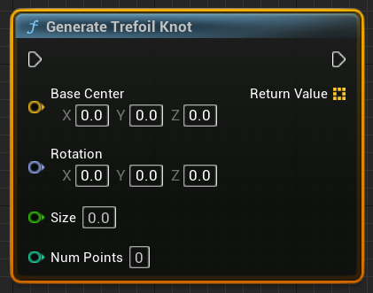{ width="300" }

| Property    | Type     | Description              |
| ----------- | -------- | ------------------------|
| BaseCenter  | FVector  | Center of the knot.      |
| Rotation    | FRotator | Rotation of the knot.    |
| Size        | float    | Size of the knot.        |
| NumPoints   | int      | Number of points.        |
