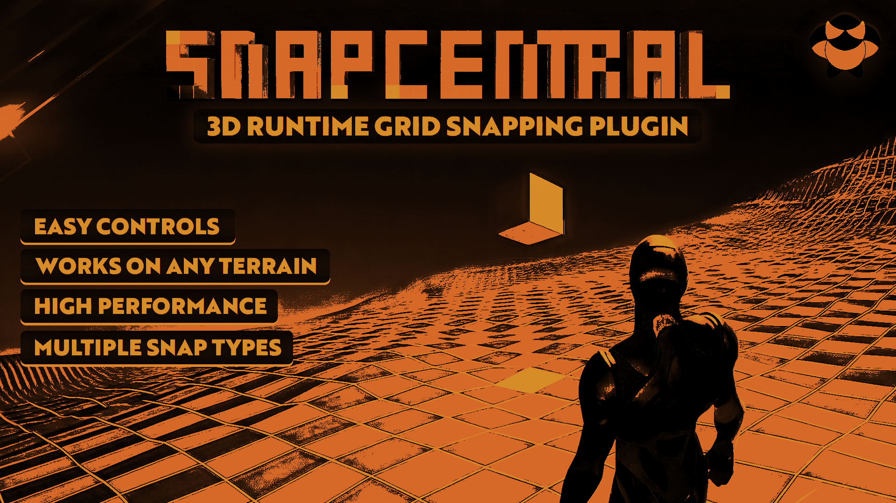
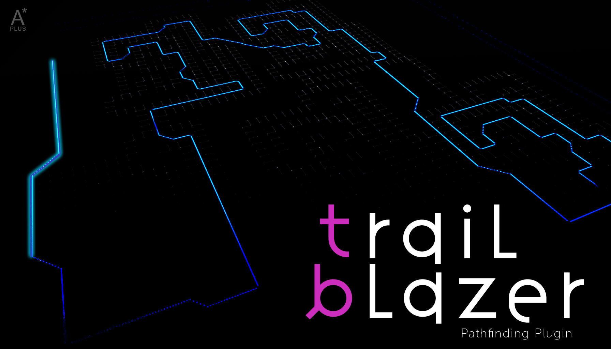
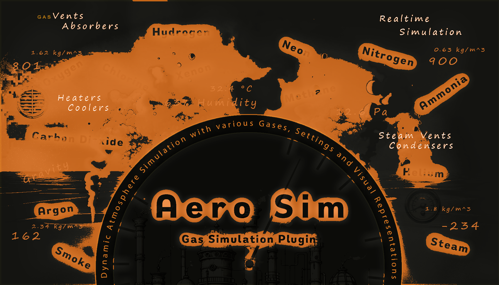

# Carbon IQ Plugins

## Snap Central

Designed for runtime usage that provides a versatile and efficient solution for managing a precise 3D snapping system that spans across the entire world

[Epic Store](https://www.unrealengine.com/marketplace/en-US/product/snap-central){:target="_blank"} | [Trailer](https://www.youtube.com/watch?v=WuYTlhWh9xs){:target="_blank"} | [Documentation](https://carboniq-dev.github.io/site/snap-central/)

{ width="500" }

## Trail Blazer

Provides customizable solutions for specific pathfinding requirements in game development. It features dynamic obstacle handling and grid-based logic.

[Epic Store](https://www.unrealengine.com/marketplace/en-US/product/trail-blazer){:target="_blank"} | [Documentation](https://carboniq-dev.github.io/site/trail-blazer)

{ width="500" }

## Aero Sim

This plugin simulates game atmospheres, featuring a variety of gas types and atmospheric actors for enhanced environmental control.

[Epic Store](https://www.unrealengine.com/marketplace/en-US/product/aero-sim){:target="_blank"}| [Trailer](https://www.youtube.com/watch?v=Eusi11w4dRo){:target="_blank"} | [Documentation](https://carboniq-dev.github.io/site/aero-sim)

{ width="500" }

## Flux Point

!!! Danger "Review"
    This Plugin is currently being reviewed by Epic

This plugin is a ShapeGen toolkit for Unreal Engine, offering 18 meticulously crafted functions for effortlessly generating vectors across various 2D and 3D shapes.

Epic Store | [Documentation](https://carboniq-dev.github.io/site/flux-point)

{ width="500" }
