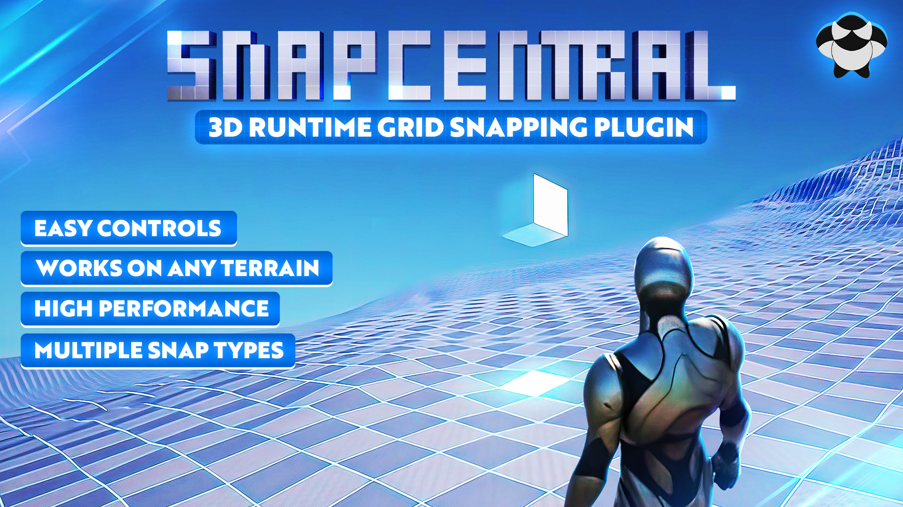

# Carbon IQ Plugins

## Snap Central

Designed for runtime usage that provides a versatile and efficient solution for managing a precise 3D snapping system that spans across the entire world

[Epic Store](https://www.unrealengine.com/marketplace/en-US/product/snap-central){:target="_blank"} | [Trailer](https://www.youtube.com/watch?v=WuYTlhWh9xs&ab_channel=carbonIQ){:target="_blank"} | [Documentation](https://carboniq-dev.github.io/site/snap-central/)

{ width="500" }

## Trail Blazer

!!! Danger "Review"
    This plugin is currently undergoing the review process by Epic Games.

Provides customizable solutions for specific pathfinding requirements in game development. It features dynamic obstacle handling and grid-based logic.

Epic Store | [Documentation](https://carboniq-dev.github.io/site/trail-blazer)

{ width="500" }

<!-- ## Atmo Sim

A comprehensive atmospheric simulation plugin for Unreal Engine

Epic Store | Documentation

{ width="500" }

!!! Note
    Release date: 01.02.2024

## Cube Verse

xxxxxxxxxxxxxxxxxxxxxxxxx

Epic Store | Documentation

{ width="500" }

!!! Note
    Release date: 01.02.2024

## Flux Point

xxxxxxxxxxxxxxxxxxxxxxxxx

Epic Store | Documentation

{ width="500" }

!!! Note
    Release date: 01.02.2024 -->
