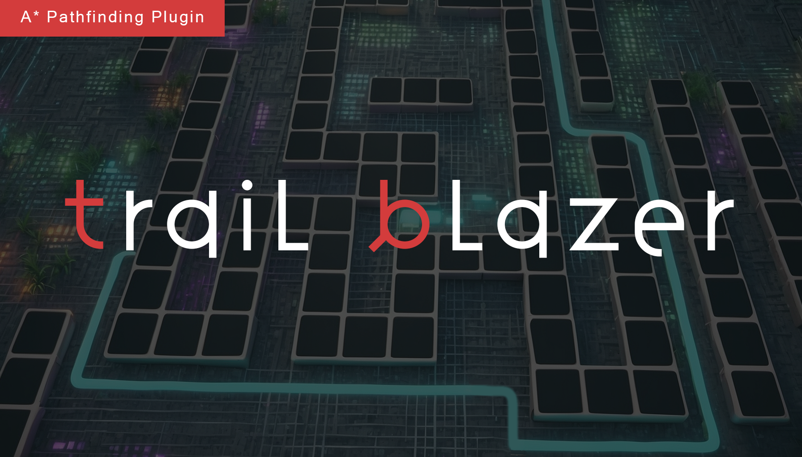

# Carbon IQ Plugins

## Snap Central

Designed for runtime usage that provides a versatile and efficient solution for managing a precise 3D snapping system that spans across the entire world

[Epic Store](https://www.unrealengine.com/marketplace/en-US/product/snap-central){:target="_blank"} | [Trailer](https://www.youtube.com/watch?v=WuYTlhWh9xs&ab_channel=carbonIQ){:target="_blank"} | [Documentation](https://carboniq-dev.github.io/site/snap-central/)

{ width="500" }

## Trail Blazer

Provides customizable solutions for specific pathfinding requirements in game development. It features dynamic obstacle handling and grid-based logic.

Epic Store | [Documentation](https://carboniq-dev.github.io/site/trail-blazer)

{ width="500" }

!!! Note
    This plugin is currently undergoing the review process by Epic Games.
<!-- 
## Atmo Sim

A comprehensive atmospheric simulation plugin for Unreal Engine

Epic Store | Documentation

{ width="500" }

!!! Note
    Release date: 01.02.2024

## Cube Verse

xxxxxxxxxxxxxxxxxxxxxxxxx

Epic Store | Documentation

{ width="500" }

!!! Note
    Release date: 01.02.2024

## Flux Point

xxxxxxxxxxxxxxxxxxxxxxxxx

Epic Store | Documentation

{ width="500" }

!!! Note
    Release date: 01.02.2024 -->
