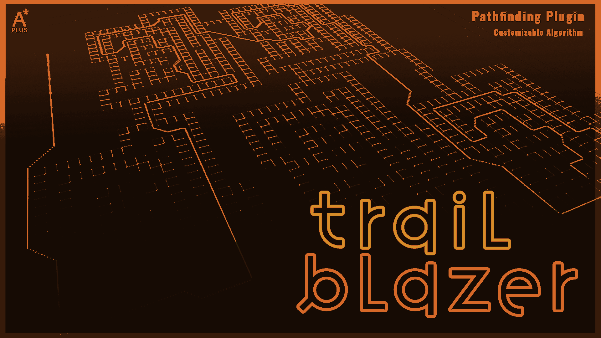

# Unreal Engine Plugins

## Snap Central

Designed for runtime usage that provides a versatile and efficient solution for managing a precise 3D snapping system that spans across the entire world

[Epic Store](https://www.unrealengine.com/marketplace/en-US/product/snap-central){:target="_blank"} [Trailer](https://www.youtube.com/watch?v=WuYTlhWh9xs&ab_channel=carbonIQ){:target="_blank"} [Documentation](https://carboniq-dev.github.io/site/snap-central/)

{ width="500" }

## Trail Blazer

Provides customizable solutions for specific pathfinding requirements in game development. It features dynamic obstacle handling and grid-based logic.

[Epic Store](https://www.unrealengine.com/marketplace/en-US/product/trail-blazer){:target="_blank"} [Documentation](https://carboniq-dev.github.io/site/trail-blazer)

{ width="500" }

## Aero Sim
<!-- 
!!! Danger "Review"
    Epic Games is currently in the process of reviewing this plugin. -->

!!! Example "Comming soon"
    Estimated release: **January 2024**

This plugin simulates game atmospheres, featuring a variety of gas types and atmospheric actors for enhanced environmental control.

Epic Store [Documentation](https://carboniq-dev.github.io/site/aero-sim)

{ width="500" }

## Flux Point

!!! Example "Comming soon"
    Estimated release: **January 2024**

Flux Point is a versatile plugin that effortlessly generates vectors for spawning particles or meshes, suitable for both 2D and 3D shapes.

Epic Store | Documentation

{ width="500" }
