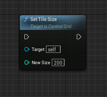

# Runtime Controls

To enhance flexibility during runtime, you can utilize the following functions.

### Set Grid Visibilities

Sets the visibility of the Grid, Area, Selected Tile, and Preview Mesh.

### Set Tile Size

Sets the tile size.

### Get AOE

Calculates the locations of tiles around a given snap location based on a specified extension factor.

