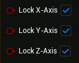

# Input Parameters

This section provides an overview of the input parameters available on the exposed **Get Snap Parameters** function.

### Parameters

| Property        | Type        | Description                                                                                                                                 |
| --------------- | ----------- | ------------------------------------------------------------------------------------------------------------------------------------------- |
| Target          | Actor       | Reference to the **Central Grid** actor.                                                                                                    |
| Target Object   | Object      | Specifies the object to use as the target for an automatic line trace and snap location calculation. Can be an actor or a camera component. |
| Target Location | Vector      | Where to locate the nearest snap location. Should not be used if **Target Object** is set.                                                  |
| Snap Type       | SnapType    | Determines the method used to calculate the z-coordinate of the snap location.                                                              |
| Snap To         | SnapAxis    | Specifies the axis to which snapping should occur.                                                                                          |
| Lock            | LockAxis    | Defines the positional axis to be locked onto.                                                                                              |
| Preview Mesh    | Static Mesh | Mesh will serve as the preview.                                                                                                             |

#### Snap Type

| Option         | Description                                                                                                                                                                                                                                                                                                                                                                                                                                                                                                                                                                                                                                                                                                                                                                                                                                                               |
| -------------- | ------------------------------------------------------------------------------------------------------------------------------------------------------------------------------------------------------------------------------------------------------------------------------------------------------------------------------------------------------------------------------------------------------------------------------------------------------------------------------------------------------------------------------------------------------------------------------------------------------------------------------------------------------------------------------------------------------------------------------------------------------------------------------------------------------------------------------------------------------------------------- |
| Tile Center    | Calculates the z-coordinate of the snap location by tracing the center of the target tile.                                                                                                                                                                                                                                                                                                                                                                                                                                                                                                                                                                                                                                                                                                                                                                                |
| Average Corner | Calculates the z-coordinate of the snap location by tracing the corners of the target tile and taking the average.                                                                                                                                                                                                                                                                                                                                                                                                                                                                                                                                                                                                                                                                                                                                                        |
| Lowest Corner  | Calculates the z-coordinate of the snap location by tracing the corners of the target tile and taking only the lowest corner into account.                                                                                                                                                                                                                                                                                                                                                                                                                                                                                                                                                                                                                                                                                                                                |
| Highest Corner | Calculates the z-coordinate of the snap location by tracing the corners of the target tile and taking only the highest corner into account.                                                                                                                                                                                                                                                                                                                                                                                                                                                                                                                                                                                                                                                                                                                               |
| Hit Location   | The z-coordinate of the snap location is established as the z-coordinate of the hit location, or alternatively, as the z-coordinate of the end location in the absence of any hit detection. This is particularly useful when pointing at buildings or other obstacles, or locking objects onto a specific distance by setting **Object Trace Distance** on the **Central Grid** actor to a low value. <mark>Please take note that the inclusion of this particular feature was intended to provide users with greater flexibility. Nonetheless, it should be noted that this increased flexibility may result in the plugin partially relinquishing control over certain settings or configurations, and consequently, may not yield the intended outcome. Additionally, it should be mentioned that the vertical indicator is disabled for this particular type.</mark> |

#### Snap To

| Property       | Type    | Description                                          |
| -------------- | ------- | ---------------------------------------------------- |
| Snap To X-Axis | Boolean | If set to _true_, snapping is applied to the x-axis. |
| Snap To Y-Axis | Boolean | If set to _true_, snapping is applied to the y-axis. |
| Snap To Z-Axis | Boolean | If set to _true_, snapping is applied to the z-axis. |

#### Lock

| Property    | Type    | Description                                                |
| ----------- | ------- | ---------------------------------------------------------- |
| Lock X-Axis | Boolean | If set to _true_, position will be locked onto the x-axis. |
| Lock Y-Axis | Boolean | If set to _true_, position will be locked onto the y-axis. |
| Lock Z-Axis | Boolean | If set to _true_, position will be locked onto the z-axis. |
