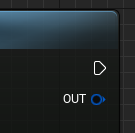
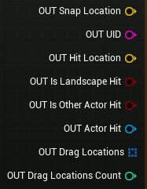

# Ouput Parameters

This section provides an overview of the ouput parameters available on the exposed **Get Snap Parameters** function.

_collapsed_

_expanded_

### Snap Parameters

| Property             | Type               | Description                                                                                                                                                                                                                                |
| -------------------- | ------------------ | ------------------------------------------------------------------------------------------------------------------------------------------------------------------------------------------------------------------------------------------ |
| Snap Location        | Vector             | The closest snap location calculated based on the **Target Object** or **Target Vector** passed to the corresponding pin.                                                                                                                  |
| Snap Location UID    | String             | The unique identifier string for the current snap location is the hash of the snap location. It is important to note that the UID will change if you modify the **Tile Size**, as this will cause the snap locations to shift accordingly. |
| Hit Location         | Vector             | The hit location used for calculations.                                                                                                                                                                                                    |
| Is Landscape Hit     | Boolean            | Indicates whether a trace hit result is from a landscape actor or not.<mark> Works only if **Target Object** is set</mark>.                                                                                                                |
| Is Other Actor Hit   | Boolean            | Indicates whether a trace hit result is from any actor or not. <mark>Works only if **Target Object** is set</mark>.                                                                                                                        |
| Actor Hit            | Actor              | Actor returned by the trace hit result.                                                                                                                                                                                                    |
| Drag Locations       | Array<DragResult\> | The drag result data for each snap location is stored in an array, which requires snapping to either the X and Y-axis or the Z-axis and dragging over a minimum of two tiles in order to hold meaningful values.                           |
| Drag Locations Count | Int                | The number of detected tiles on the dragged area.                                                                                                                                                                                          |

### Drag Result

| Property | Type   | Description                                                             |
| -------- | ------ | ----------------------------------------------------------------------- |
| Location | Vector | Snap location closest to a specific location where a drag has occurred. |
| UID      | String | Unique identifier string for the snap location.                         |
