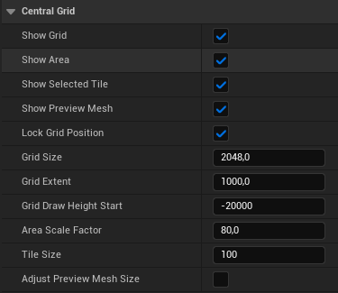
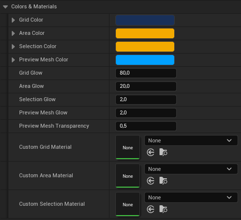
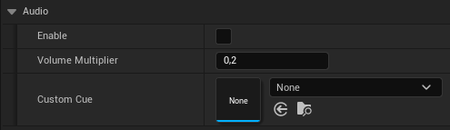
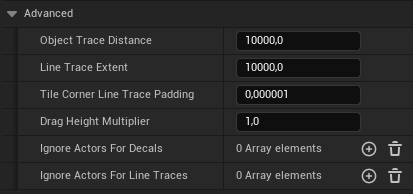
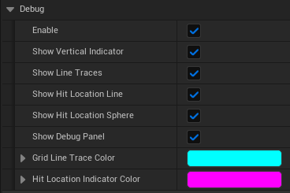

# Grid Actor

This section provides an overview of the **CentralGrid** actor's properties that affect the grid logic, visuals and debugging.

### Main

| Property                 | Type    | Description                                                                                                                                                                   |
| ------------------------ | ------- | ----------------------------------------------------------------------------------------------------------------------------------------------------------------------------- |
| Show Grid                | Boolean | If set to _true_, the grid will be visible. **Can be set at runtime.**                                                                                                        |
| Show Area                | Boolean | If set to _true_, the area around the selected tile will be visible. **Can be set at runtime.**                                                                               |
| Show Selected Tile       | Boolean | If set to _true_, the selected tile will be visualized. **Can be set at runtime.**                                                                                            |
| Show Preview Mesh        | Boolean | If set to _true_, a preview mesh will spawn to visualize and demonstrate item placement on the current snap location. **Can be set at runtime.**                              |
| Lock Grid Position       | Boolean | If set to _true_, the grid position will be locked. **Snapping will stay unaffected.**                                                                                        |
| Grid Size                | Float   | Specifies the area size of the grid. **Snapping will stay unaffected.**                                                                                                       |
| Grid Extent              | Float   | Specifies the extent of the grid. The greater the landscape elevation, the higher this value should be. **Snapping will stay unaffected.**                                    |
| Grid Draw Height Start   | Int     | Specifies the start height from where the grid will be drawn. **Snapping will stay unaffected.**                                                                              |
| Area Scale Factor        | Float   | Defines the scaling factor for the area surrounding the selected tile. The size of the area is proportional to the size of the tile and can be increased by a set percentage. |
| Tile Size                | Int     | Defines the size of the grid tiles.                                                                                                                                           |
| Adjust Preview Mesh Size | Boolean | If set to _true_, the preview mesh will be resized in accordance with the tile size.                                                                                          |

### Colors & Materials

| Property                  | Type         | Description                                                                 |
| ------------------------- | ------------ | --------------------------------------------------------------------------- |
| Grid Color                | Linear Color | Defines the color of the grid.                                              |
| Area Color                | Linear Color | Defines the color of the area surrounding the tile.                         |
| Selection Color           | Linear Color | Defines the color of the selected tile.                                     |
| Preview Mesh Color        | Linear Color | Defines the color of the preview mesh.                                      |
| Grid Glow                 | Float        | Defines the glow intensity of the grid.                                     |
| Area Glow                 | Float        | Defines the glow intensity of the area surrounding the tile.                |
| Selection Glow            | Float        | Defines the glow intensity of the selected tile.                            |
| Preview Mesh Glow         | Float        | Defines the glow intensity of the preview mesh.                             |
| Preview Mesh Transparency | Float        | Defines the transparency of the preview mesh.                               |
| Custom Grid Material      | Material     | Replaces the material used by the plugin for the grid.                      |
| Custom Area Material      | Material     | Replaces the material used by the plugin for the area surrounding the tile. |
| Custom Selection Material | Material     | Replaces the material used by the plugin for the selected tile.             |

### Audio

| Property          | Type      | Description                                                                                                                                                          |
| ----------------- | --------- | -------------------------------------------------------------------------------------------------------------------------------------------------------------------- |
| Enable            | Boolean   | If set to _true_, audio feedback for selected tiles is enabled. The playing of audio is dependent on the settings configured in the **Get Snap Parameter** function. |
| Volume Multiplier | Float     | Volume multiplier for the audio feedback (Range 0-1).                                                                                                                |
| Custom Cue        | Sound Cue | Replaces the audio cue used by the plugin.                                                                                                                           |

### Advanced

| Property                       | Type          | Description                                                                                                                                                                                                                                                                                                                                                            |
| ------------------------------ | ------------- | ---------------------------------------------------------------------------------------------------------------------------------------------------------------------------------------------------------------------------------------------------------------------------------------------------------------------------------------------------------------------- |
| Object Trace Distance          | Float         | Defines the **Target Object** trace distance. This value will be overwritten if **Lock Z-Axis** is set to _true_ on the **GetSnapParameter** function.                                                                                                                                                                                                                 |
| Line Trace Extent              | Float         | Alters the start and end location for the line traces to calculate the z-coordinate to snap to.                                                                                                                                                                                                                                                                        |
| Tile Corner Line Trace Padding | Float         | Specifies the padding of the corner line traces. It is <mark>crucial</mark> to <mark>note</mark> that the value should only be intentionally set to zero or lower, as traces will hit the neighboring tile and potentially cause undesired side effects. The minimum value, which corresponds to the center location of the tile, is equivalent to half the tile size. |
| Drag Height Multiplier         | Float         | Multiplies the drag height, allowing you to drag higher but will also make scrolling more rapid.                                                                                                                                                                                                                                                                       |
| Ignore Actors For Decals       | Array<Actor\> | Actors added to the array will not be affected by the grid visuals. This includes the grid, area and selected tile decals.                                                                                                                                                                                                                                             |
| Ignore Actors For Line Traces  | Array<Actor\> | Actors added to the array will not be affected by any line traces issued by this plugin.                                                                                                                                                                                                                                                                               |

### Debug

| Property                     | Type    | Description                                                                                                         |
| ---------------------------- | ------- | ------------------------------------------------------------------------------------------------------------------- |
| Enable                       | Boolean | Enables debug settings.                                                                                             |
| Show Vertical Indicator      | Boolean | If set to _true_, a vertical indicator will appear to assist with debugging vertical dragging.                      |
| Show Line Traces             | Boolean | If set to _true_, all line traces used by the plugin for calculations will be visible.                              |
| Show Hit Location Line       | Boolean | If set to _true_, the original hit location will be indicated by a vertical line.                                   |
| Show Hit Location Sphere     | Boolean | If set to _true_, the original hit location will be indicated by a sphere.                                          |
| Show Debug Panel             | Boolean | If set to _true_, a debug panel containing the most important information will be displayed in the top-left corner. |
| Line Trace Color             | Color   | Defines the color of the line traces.                                                                               |
| Hit Location Indicator Color | Color   | Defines the color of the original hit location indicator.                                                           |
