# Examples

=== "Showcases"

    !!! example "1. Pathfinding on a maze"
        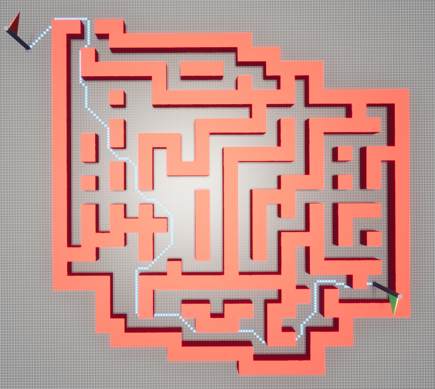{ width="200" }

    !!! example "2. Pathfinding on large maze (Maxed out)"
        Landscape settings

        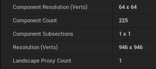{ width="100" }

        Grid settings

        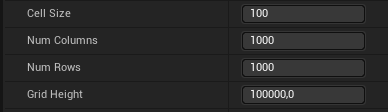{ width="100" }

        Maze

        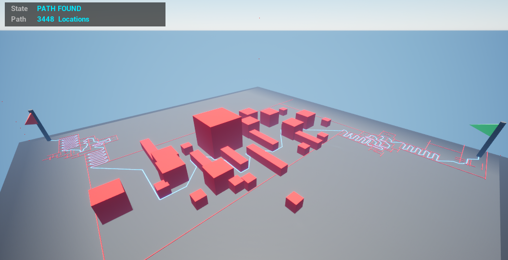{ width="200" }

    !!! example "3. Pathfinding on stairs"
        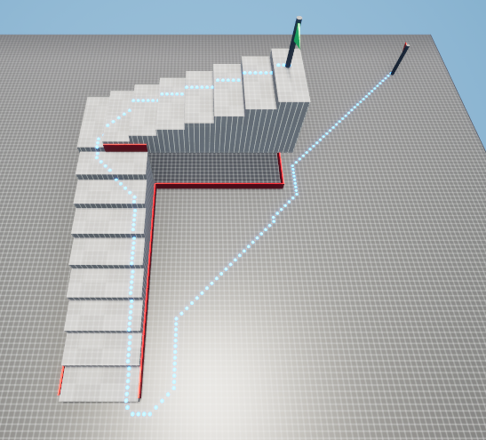{ width="200" }

    !!! example "4. Handling multiple elevated landscapes"
        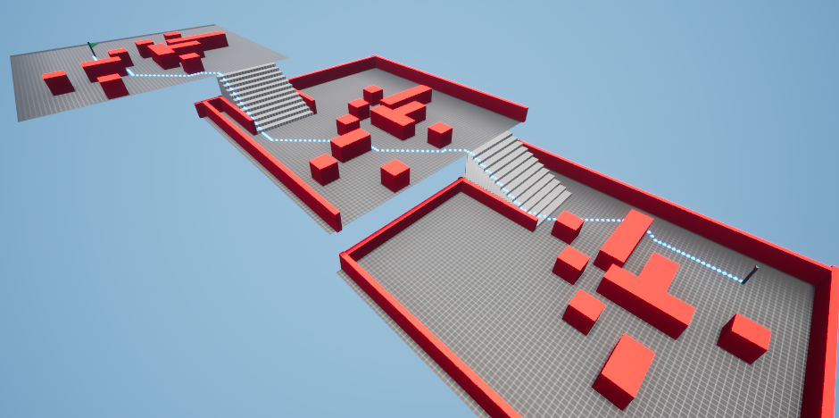{ width="200" }

    !!! example "5. Ingoring specific obstacles for detection and/or height adjustments"
        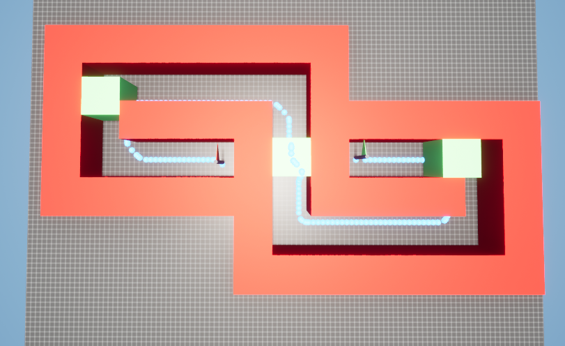{ width="200" }

=== "Edge cases"

    These scenarios go beyond what this plugin was originally designed for. However, with the options for spherical and rectangular precision, you can adapt it to handle some unique situations. But remember, these adjustments come with a trade-off: longer load times. It's particularly important to be mindful when you're expanding the grid size while also shrinking the cell size to a smaller dimension. Doing so can lead to significantly longer load times, especially when you're working with rectangular precision. The reason behind this is the complex way the system calculates obstructions. There's a noticeable difference in how it processes objects that are rotated versus those aligned with the grid's orientation. Each requires a specific method in their calculation, adding to the complexity and load time.

    !!! Note
        The current limitations are recognized, and there are plans for future optimization. This will aim to streamline these functionalities and incorporate them seamlessly as a feature of the plugin. Stay tuned for updates!

    !!! example "8. Obstacles rotation not aligned with grid"
        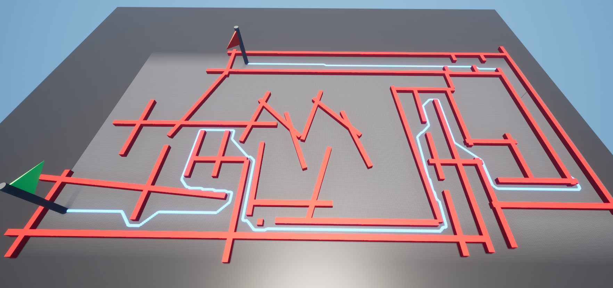{ width="200" }

    !!! example "9. Spherical obstacles detection"
        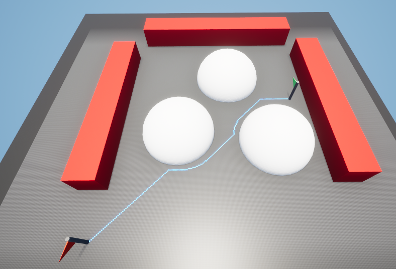{ width="200" }

=== "Heuristic Types"

    Chebyshev

    { width="200" }

    Euclidean

    { width="200" }

    Euclidean Weighted

    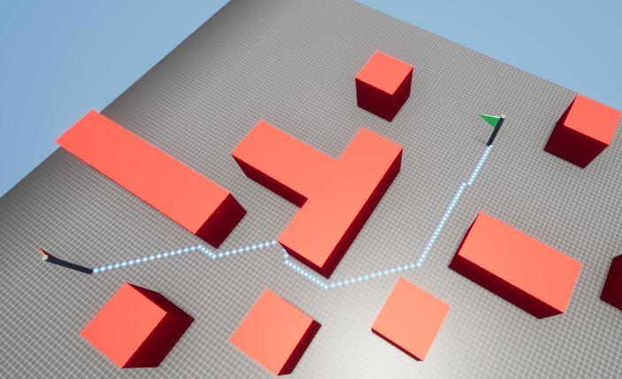{ width="200" }

    Manhatten

    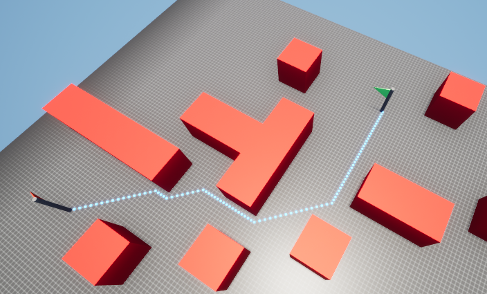{ width="200" }

    Tie Breaking Euclidean

    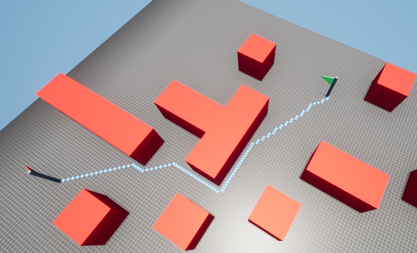{ width="200" }

=== "Pathfinding Settings"

    90 Degrees Turns

    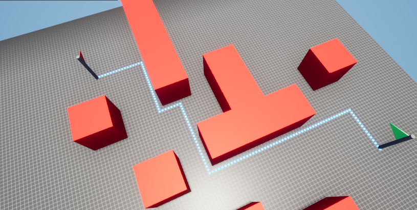{ width="200" }

    Diagonals

    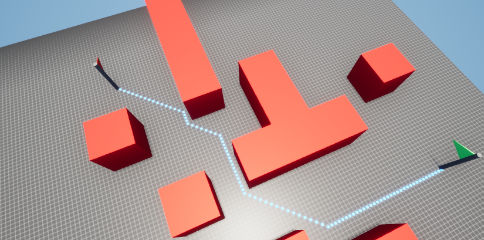{ width="200" }

    No Buffer

    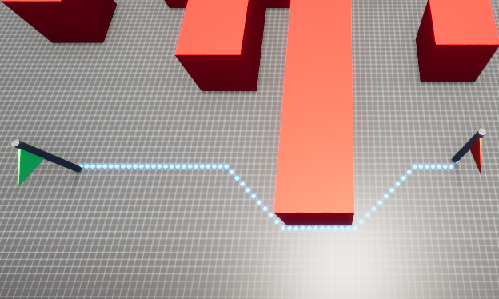{ width="200" }

    Buffer

    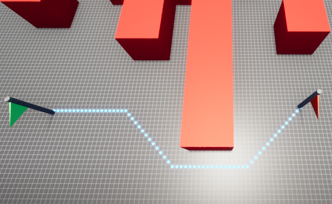{ width="200" }

    Sharp Turns

    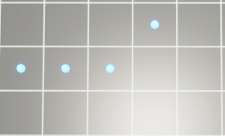{ width="200" }

    Smooth Turns

    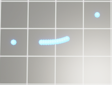{ width="200" }