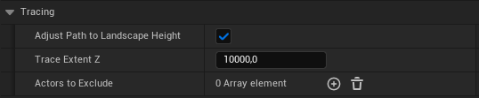

# Actor

This section provides an overview of the **TrailBlazer** actor's properties that affect the pathfinding logic and debugging.

## Grid

| Property                             | Type                             | Description                                                                                                                        |
| ------------------------------------ | -------------------------------- | ---------------------------------------------------------------------------------------------------------------------------------- |
| Cell Size                            | Integer                            | Defines the dimensions of each individual cell within the grid used for pathfinding.                                             |
| Num Columns                          | Integer                          | Specifies the number of columns in the grid. Increasing this value expands the grids width.                                 |
| Num Rows                             | Integer                          | Specifies the number of rows in the grid. Increasing this value expands the grids depth.                                     |
| Grid Height | Float | Specifies the vertical scope of the grid. Obstructions beyond this range will not be detected. |
| Use Actors As Cells | Boolean | When activated, actors of a designated type will define the walkable area. |
| Actor Type As Cell | TSubclassOf<AActor> | Defines an actor type that will be used to define the walkable area. |
| Heuristic Type                       | Enumeration                      | Selects the type of heuristic algorithm used for calculating the pathfinding cost. Different heuristics can affect the efficiency and path quality. |
| Weight                     | Float                            | Applies a weight to the Euclidean distance in the pathfinding calculation, influencing how straight or direct paths are.           |
| Include Diagonals                    | Boolean                          |  This setting enables diagonal movements in pathfinding, offering a balance between simplicity and coverage. It is the most performant option.                         |
| Use Sperical Precision                    | Boolean                          | When enabled, this mode takes spherical shapes into account during obstacle detection. This setting is useful for environments with round obstacles like spheres or cylinders, providing more accurate paths around such shapes. However, this increased precision comes with a moderate performance cost on game start.  |
| Use Rectangular Precision  | Boolean    | This is the most detailed and performance-intensive mode during obstacle detection on game start. It considers the rotation obstacles, allowing for precise pathfinding around irregularly shaped and rotated objects. This mode is ideal for complex environments with non-axis aligned or intricately shaped obstacles. {==**WARNING: This option can significantly increase load times due to its highly intensive calculations.**==} |
| Add Cell Buffer                      | Boolean                          | Enables a buffer zone around each cell, marking nearby cells as unwalkable to create a safer path.                                 |
| Buffer Distance                      | Integer                          | Sets the size of the buffer zone around obstacles, defined as the number of cells. Larger values increase the clearance around obstacles. |
| Smooth Turns                         | Boolean                          | Activates path smoothing to reduce sharp turns, making movement along the path more natural.                                    |
| Smoothing Interpolation Points       | Integer                          | Determines the number of points used to smooth out turns along the path. Higher values result in smoother paths but may affect performance. |
| Smoothing Angle Threshold            | Float                            | Sets the angle threshold for smoothing. Turns sharper than this angle will be smoothed out.                                      |

## Heuristic Types

| Type                              | Description                                                                                                                                        |
| --------------------------------- | -------------------------------------------------------------------------------------------------------------------------------------------------- |
| Chebyshev                | Considers the maximum of the absolute differences of the Cartesian coordinates. It's effective for grids allowing diagonal movement, as it treats horizontal, vertical, and diagonal moves as having equal cost. |
| Euclidean                | Measures the straight-line distance between two points in the grid. This is the most direct and shortest path but may not always be the most efficient in terms of path cost or real-world navigation. |
| Weighted Euclidean       | Similar to Euclidean, but with a weight multiplier applied. This emphasizes straight-line paths, making them more favorable in the pathfinding calculation, often leading to more direct routes. |
| Manhattan             | Calculates the sum of the absolute differences of the Cartesian coordinates. Ideal for grid-based maps where movement is typically restricted to horizontal and vertical directions (like city blocks). |
| Manhattan Euclidean      | A hybrid approach that averages Manhattan and Euclidean distances. This can provide a balance between direct paths and path costs, especially in less restricted grid environments. |
| Tie-Breaking Euclidean  | Adds a small cost to the standard Euclidean heuristic to help break ties between paths of equal length. This can be useful in reducing the number of nodes explored and ensuring more deterministic pathfinding. |

## Obstacles

| Property                             | Type                             | Description                                                                                                                        |
| ------------------------------------ | -------------------------------- | ---------------------------------------------------------------------------------------------------------------------------------- |
| Ignore All Obstacles                 | Boolean                          | If enabled, the pathfinding algorithm will ignore all obstacles, allowing free movement across the grid.                         |
| Obstacle Types To Exclude            | Array of TSubclassOf<AActor>      | Defines a list of actor types that should be ignored as obstacles, allowing paths to pass through them.                           |
| Obstacles To Exclude                 | Array of AActor*                  | Specifies individual actors to be excluded from being considered as obstacles in path calculations.                              |

## Tracing

| Property                             | Type                             | Description                                                                                                                        |
| ------------------------------------ | -------------------------------- | ---------------------------------------------------------------------------------------------------------------------------------- |
| Adjust Path To Landscape Height      | Boolean                          | When enabled, adjusts the path's height to match the landscape's contour, useful for uneven terrain.                             |
| Trace Extent Z                       | Float                            | Determines the vertical range for landscape height adjustments during path calculations. |
| Actors To Exclude                    | Array of AActor*                  | Additional actors to exclude from height tracing.                                                                                   |

## Debug

| Property                             | Type                             | Description                                                                                                                        |
| ------------------------------------ | -------------------------------- | ---------------------------------------------------------------------------------------------------------------------------------- |
| Show Grid Cells                           | Boolean                          | Display the grid cells in the game world for debugging purposes.                                                                       |
| Show Grid Extent                           | Boolean                          | Display the grid extent in the game world for debugging purposes.                                                                       |
| Grid Decal Extent                           | Float                          | READONLY: This variable is set to a value that mirrors the current grid height and ensures that the grid cells will always be visible when debugging.                                                                       |
| Show Path Locations                  | Boolean                          | Display calculated path locations in the game world for debugging.                                                               |
| Show Path Life Time                  | Float                            | Lifetime of the visual representation of the path. Increase for longer-lasting paths.                                            |
| Path Particles Scale                 | Float                            | Scale of the particles used to visualize the path.                                                                               |
| Show Path Movement                   | Boolean                          | Visualize the movement along the path for debugging.                                                                             |
