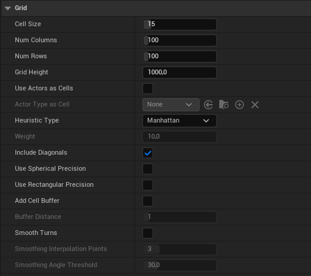

# Actor

This section provides an overview of the **TrailBlazer** actor's properties that affect the pathfinding logic and debugging.

## Grid

| Property                 | Type    | Description                                                                                                                                                                   |
| ------------------------ | ------- | ----------------------------------------------------------------------------------------------------------------------------------------------------------------------------- |
| Cell Size | Float | Defines the dimensions of each individual cell within the grid used for pathfinding .                                                                                                       |
| Cell Height | Float |  Sets the starting height on the Z-axis from which the plugin begins its vertical detection of obstacles and terrain features within the grid.
| Num Columns | Int | Specifies the number of cells vertically across the pathfinding grid, determining the grid's height.                                                                               |
| Num Rows | Int | Specifies the number of cells horizontally along the pathfinding grid, establishing the grid's width.                                                                                         |
| Include Diagonals | Boolean   |  Specifies whether the pathfinding algorithm should consider diagonal paths between adjacent grid cells. |
| Smooth | Boolean   |  When enabled, activates the path smoothing feature, creating more natural and curved trajectories between waypoints in the generated path |
| Smoothing Interpolation Points | Int   |  Specifies the number of intermediate points used in the smoothing process to create more gradual curves along the path. |
| Smoothing Angle Threshold | Float   |  Specifies the minimum angle between path segments at which the smoothing algorithm is applied to create smoother turns. |

## Obstacles

| Property                 | Type    | Description                                                                                                                                                                   |
| ------------------------ | ------- | ----------------------------------------------------------------------------------------------------------------------------------------------------------------------------- |
| Ignore Obstacles   | Boolean | Allows the pathfinding algorithm to disregard obstacles.                                     |
| Exclude Obstacle Types   | Array | An array of actor types that the pathfinding algorithm will exclude from consideration as obstacles, allowing paths to be calculated without being affected by specific types of actors in the world..                                     |
| Max Height Above Ground | Float | Defines the maximum height above the ground level at which obstacles will be detected and considered in path calculations.
| Treat Buffer as Unwalkable | Boolean   | If set, marks all cells within the buffer distance of obstacles as unwalkable. |
| Buffer Distance | Int   |  Determines the number of cells around each obstacle to be maintained as a buffer zone.                                                                                                       |

## Tracing

| Property                 | Type    | Description                                                                                                                                                                   |
| ------------------------ | ------- | ----------------------------------------------------------------------------------------------------------------------------------------------------------------------------- |
| Ignore Actors | Array  | Holds an array of actors that the pathfinding system will exclude when conducting traces to determine the z-axis values of path locations. |
| Trace Landscape Only       | Boolean | When enabled, restricts the obstacle detection process to only consider the landscape.
| Landscape Height Trace Extent       | Float | Specifies the vertical extent (both above and below) for the line trace used in determining the landscape height.                                                                               |

## Debug

| Property                 | Type    | Description                                                                                                                                                                   |
| ------------------------ | ------- | ----------------------------------------------------------------------------------------------------------------------------------------------------------------------------- |
| Start Location       | Vector | A vector specifying the starting point for the pathfinding process. **Will be overwritten if Start Actor is set.**                                                                                        |
| End Location       | Vector |  A vector specifying the end point for the pathfinding process. **Will be overwritten if End Actor is set.** |                                                          |
| Start Actor       | Actor | An actor reference that serves as the starting point for the pathfinding process.                                                                                         |
| End Actor       | Actor | An actor reference that serves as the end point for the pathfinding process.                                                                                         |
| Find Path on Begin Play       | Boolean | When enabled, triggers the pathfinding process automatically on BeginPlay.                                                                                          |
| Show Path Locations       | Boolean | When enabled, triggers visual debugging aids to display the calculated path locations.                                                                                         |
| Show Path Life       | Float | Defines the time in seconds for which the visual representation of the path will be displayed. |
| Show Path Movement       | Boolean | Enables real-time visual representation of an actor's movement along the calculated path.                                                                                        |
| Show Grid | Boolean | When enabled, visually outlines the total area covered by the pathfinding grid and it's cells. |

!!! Tip
    If no path was found or obstacles are not detected but you're sure everything is set up correctly, consider adjusting either the **Cell Height** property, the **Max Height Above Ground** property, or both.
