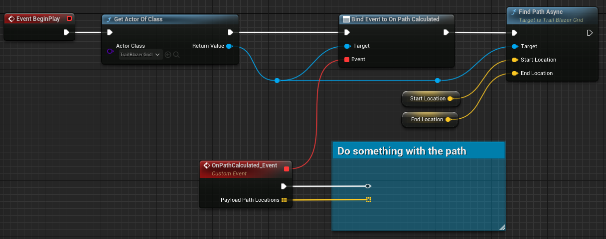

# Usage

## Quickstart

I've prepared an initial blueprint setup that demonstrates the intended usage of the TrailBlazer plugin. Begin by adding the **TrailBlazerGrid_BP**, **TrailBlazerStarter_BP**, and two **TrailBlazer_Debug_StartEndIndicator_BP** blueprints to your world. Next, select the placed TrailBlazerStarter_BP and configure either the start/end actor or the start/end location. To initiate the pathfinding process, press the play button and left-click in your world.

## Custom Setup

To get started, open the actor you wish to have control over the pathfinding feature. Obtain a reference to the **TrailBlazerGrid_BP** previously placed in the world. Drag out from the output pin and bind the **On Path Calculated** event. Afterward, drag out again and search for the **Find Path Async** function.
Specify the start and end locations. Please note that the locations must be within the grid.
Connect the nodes as illustrated below.

{ width="800" }

## Handling rotated actors

- Since the plugin operates on a grid-based system, it naturally assumes that obstacles are also aligned with the grid rotation by default. However, if you find the need to use rotated actors as obstacles, you can enable the **Use Rotation Precision** flag to accommodate this requirement. It's important to note that enabling this feature may increase load times, particularly if your grid is large and the cell size is set to a small number.
- So when dealing with rotated static meshes and actors, it's crucial to place them within an actor that includes a box collision component accurately encapsulating the target mesh. This step ensures that the obstacle detection system can precisely identify the boundaries of the actual shape, when the actor is not aligned with the grid rotation.

## Handling round objects

Similarly, if you have round objects that need to be considered in obstacle detection, it's advisable to enclose them within an actor featuring a sphere collision component. This approach allows the system to accurately detect the boundaries of round objects, ensuring they are appropriately recognized during pathfinding calculations. If circular path calculations are unnecessary, you can enclose it with a box collision to have it treated as a rectangular shape.

## Object detection

Cameras and pawns hovering within the obstacle detection range on game start will be detected as obstacles, potentially preventing a path from being found. In such cases, they should be explicitly excluded in the obstacles section to avoid this issue.

Path calculation

- Given that the plugin offers numerous settings that impact obstacle detection and path calculation, it's crucial to be aware that if a path cannot be found, it may be due to conflicting settings.  These conflicts could arise from options such as an excessively large enabled buffer, precision settings, or heuristics.
- Another possible reason for the inability to find a path is a highly complex environment. It's important to stress that this plugin is {==NOT==} designed for handling vast maps typically found in Open World games. Therefore, its use in such scenarios should be approached with caution.

Plugin content

If for any reason you cannot locate the plugin content mentioned in this documentation within the _Place Actor_ tab, please enable the option to display plugin content and navigate directly to the TrailBlazer plugin folder.