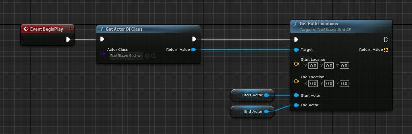
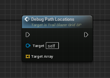

# Usage

There are two ways to use the **Get Snap Parameter** function. Both options basically do the same with one exception.

## Quickstart

The fastest way to get started is to use the built-in debug functionality. Drag the **TrailBlazerGrid_BP** actor into the world, place two actors within the grid and set the following prameter.

!!! Tip
    Depending on the placement of your **TrailBlazerGrid_BP** actor and obstacle actors, you may need to consider adjusting **Cell Height** property, the **Max Height Above Ground** property, or both if the expected path is not calculated.

## Custom

To get started with your custom implementation, open the actor you wish to have control over the pathfinding feature. Get a reference to the **TrailBlazerGrid_BP** previously placed in the world. Drag out from the output pin and search for the **Get Path Locations** function.

### With vectors

Specify the start and end locations. Keep in mind that the locations must be within the grid.

{ width="800" }

### With actor references

Specify the start and end actor references. Keep in mind that the actors must be placed within the grid.

{ width="800" }

### Debug path locations

To quickly visualize the calculated locations, you can use the **Debug Path Location** node.

### Showcase

In this showcase, the calculation is nearly instantaneous and is based on the following parameters.

| Property                 | Value    |
| ------------------------ | ------- |
| Cell Size| 20 |
| Cell Height| 100 |
| Num Columns | 300 |
| Num Rows | 300 |
| Include Diagonals | True |
| Max Height Above Ground | 1.0 |
| Treat Buffer as Unwalkable | True |
| Buffer Distance | 2 |

