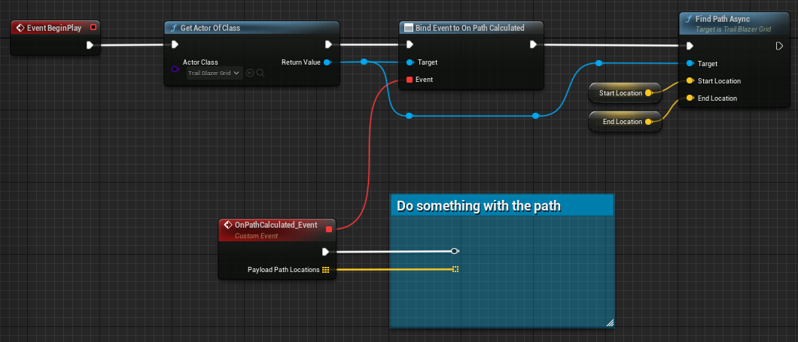

# Usage

!!! Tip "Plugin content"
    If for any reason you cannot locate the plugin content mentioned in this documentation within the _Place Actor_ tab, please enable the option to display plugin content and navigate directly to the TrailBlazer plugin folder.

!!! Warning "Handling rotated static meshes and actors"
    When dealing with rotated static meshes and actors, it's crucial to place them within an actor that includes a box collision component accurately encapsulating the target mesh. This step ensures that the obstacle detection system can precisely identify the boundaries of the actual shape, when the mesh or actor is not aligned with the grid rotation.

!!! Warning "Handling round objects"
    Similarly, if you have round objects that need to be considered in obstacle detection, it's advisable to enclose them within an actor featuring a sphere collision component. This approach allows the system to accurately detect the boundaries of round objects, ensuring they are appropriately recognized during pathfinding calculations.

## Quickstart

I've prepared an initial blueprint setup that demonstrates the intended usage of the TrailBlazer plugin. Begin by adding the **TrailBlazerGrid_BP**, **TrailBlazerStarter_BP**, and two **TrailBlazer_Debug_StartEndIndicator_BP** blueprints to your world. Next, select the placed TrailBlazerStarter_BP and configure either the start/end actor or the start/end location. To initiate the pathfinding process, press the play button and left-click in your world.

## Custom Setup

To get started, open the actor you wish to have control over the pathfinding feature. Obtain a reference to the **TrailBlazerGrid_BP** previously placed in the world. Drag out from the output pin and bind the **On Path Calculated** event. Afterward, drag out again and search for the **Find Path Async** function.
Specify the start and end locations. Please note that the locations must be within the grid.
Connect the nodes as illustrated below.

{ width="800" }

## Guidelines

The plugin's pathfinding settings offer a wide range of customization options that can significantly impact the calculation of paths. In edge cases or scenarios beyond the recommended usage, it becomes crucial to carefully adjust and experiment with these settings. It's important to note that these settings can have interdependencies, meaning changes to one setting may affect others.

- Fine-tune the grid size and cell size based on your environment’s scale and complexity.
- Use appropriate heuristic calculations based on your game’s requirements.
- In case a path is not detected, consider utilizing the precision options.

!!! Warning

    Cameras and pawns hovering within the obstacle detection range on game start will be detected as obstacles, potentially preventing a path from being found. In such cases, they should be explicitly excluded in the obstacles section to avoid this issue.

### Showcase

#### Maze

| Property                 | Value    |
| ------------------------ | ------- |
| Cell Size| 20 |
| Num Columns | 300 |
| Num Rows | 300 |
| Include Diagonals | True |
| Add Cell Buffer | True |
| Buffer Distance | 2 |

