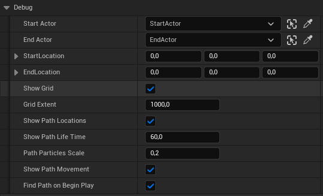

# Usage

## Quickstart

The fastest way to get started is to use the built-in debug functionality. Drag the **TrailBlazerGrid_BP** actor into the world, place two actors within the grid and set the following parameters. Alternatively you can set the start and end location.

## Custom

To get started with your custom implementation, open the actor you wish to have control over the pathfinding feature. Obtain a reference to the **TrailBlazerGrid_BP** previously placed in the world. Drag out from the output pin and bind the **On Path Calculated** event. Afterward, drag out again and search for the **Find Path Async** function.
Specify the start and end locations. Please note that the locations must be within the grid. Now, connect the nodes as illustrated below.

{ width="800" }

## Recommended

- Fine-tune the grid size and cell size based on your environment’s scale and complexity.
- Use appropriate heuristic calculations based on your game’s requirements.
- Regularly profile and monitor performance, especially in larger or more complex environments.

### Showcase

In this showcase, the calculation is nearly instantaneous and is based on the following parameters.

| Property                 | Value    |
| ------------------------ | ------- |
| Cell Size| 20 |
| Num Columns | 300 |
| Num Rows | 300 |
| Include Diagonals | True |
| Add Cell Buffer | True |
| Buffer Distance | 2 |

