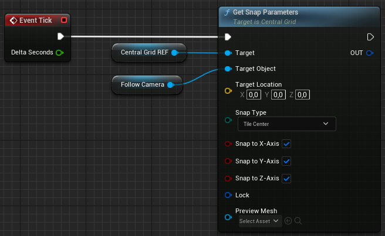
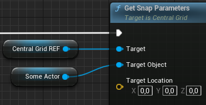
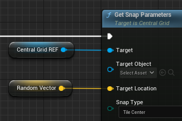

# Usage

There are two ways to use the **Get Snap Parameter** function. Both options basically do the same with one exception.

### With Object

When passing an actor or camera component to the <mark>Target Object</mark> the plugin will streamline the snapping process by automating tracing and calculations, and enables vertical drag for added flexibility.

### With Vector

When passing a vector to the <mark>Target Location</mark> the plugin will streamline the snapping process by automating tracing and calculations. However, vertical drag is disabled due to the missing pitch value which is required to calculate the drag offset on the Z-axis.

_This feature may be required for certain edge cases that involve complex character movements or actions, such as jumping off cliffs while snap-dragging along floating planes, where more dynamic positioning may be required. In these cases, it may be advisable to use only the plugin's snap logic and your own custom logic for handling the Z-axis drag._

